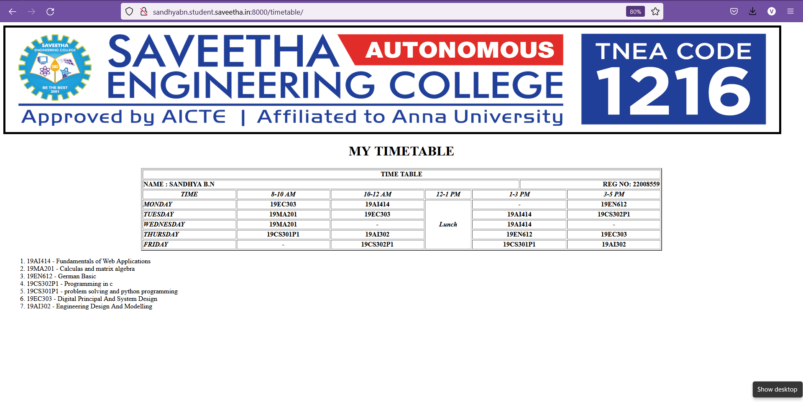

# Experiment_Time_Table

## AIM
To Write a html webpage page to display your timetable.

# ALGORITHM
### STEP 1
create a simple table using table tag
### STEP 2
Add header row using th tag
### STEP 3
Add your timetable
### STEP 4
Execute the program

# CODE
```
<!DOCTYPE html>
<html lang ='en'>
<head>
<title>My TimeTable</title>
</head>
<body>

<h1 align="center">MY TIMETABLE</h1>
<table border="2" align="center">
<TR><TH colspan="80" align="center">TIME TABLE</TH> </TR>
<tr>
<th colspan="50" align="LEFT">NAME : SANDHYA B.N</TH>
<th COLSPAN="30" align="RIGHT">REG NO: 22008559</TH>
</TR>
<TR>
<th colspan="15" align="center" WIDTH="10%"><i>TIME</i></tH>
<th colspan="15" align="center" WIDTH="10%"><i>8-10 AM</i></tH>
<tH colspan="15" align="center" WIDTH="10%"><i>10-12 AM</i></tH>
<tH  align="center" WIDTH="5%"><i>12-1 PM</i></tH>
<tH colspan="15" align="center" WIDTH="10%"><i>1-3 PM</i></tH>
<TH colspan="15" align="center" WIDTH="10%"><i>3-5 PM</i></tH>
</tr>
<TR>
<th colspan="15" align="left" WIDTH="10%"><i>MONDAY</i></tH>
<th colspan="15" align="center" WIDTH="10%">19EC303</tH>
<tH colspan="15" align="center" WIDTH="10%">19AI414</tH>
<tH rowspan="15" align="center" WIDTH="5%"><i>Lunch</i></tH>
<tH colspan="15" align="center" WIDTH="10%">-</tH>
<TH colspan="15" align="center" WIDTH="10%">19EN612</tH>
</tr>
<TR>
<th colspan="15" align="left" WIDTH="10%"><i>TUESDAY</i></tH>
<th colspan="15" align="center" WIDTH="10%">19MA201</tH>
<tH colspan="15" align="center" WIDTH="10%">19EC303</tH>
<tH colspan="15" align="center" WIDTH="10%">19AI414</tH>
<TH colspan="15" align="center" WIDTH="10%">19CS302P1</tH>
</tr>
<TR>
<th colspan="15" align="left" WIDTH="10%"><i>WEDNESDAY</i></tH>
<th colspan="15" align="center" WIDTH="10%">19MA201</tH>
<tH colspan="15" align="center" WIDTH="10%">-</tH>
<tH colspan="15" align="center" WIDTH="10%">19AI414</tH>
<TH colspan="15" align="center" WIDTH="10%">-</tH>
</tr>
<TR>
<th colspan="15" align="left" WIDTH="10%"><i>THURSDAY</i></tH>
<th colspan="15" align="center" WIDTH="10%">19CS301P1</tH>
<tH colspan="15" align="center" WIDTH="10%">19AI302</tH>
<tH colspan="15" align="center" WIDTH="10%">19EN612</tH>
<TH colspan="15" align="center" WIDTH="10%">19EC303</tH>
</tr>
<TR>
<th colspan="15" align="left" WIDTH="10%"><i>FRIDAY</i></tH>
<th colspan="15" align="center" WIDTH="10%">-</tH>
<tH colspan="15" align="center" WIDTH="10%">19CS302P1</tH>
<tH colspan="15" align="center" WIDTH="10%">19CS301P1</tH>
<TH colspan="15" align="center" WIDTH="10%">19AI302</tH>
</tr>
</table>
<uL align="center" type="none">
    <LI>1. 19AI414 - Fundamentals of Web Applications</LI>
    <li>2. 19MA201 - Calculas and matrix algebra</li>
    <li>3. 19EN612 - German Basic</li>
    <li>4. 19CS302P1 - Programming in c</li>
    <li>5. 19CS301P1 - problem solving and python programming</li>
    <li>6. 19EC303 - Digital Principal And System Design</li>
    <li>7. 19AI302 - Engineering Design And Modelling</li>
</uL>
</body>
</html>
```

# OUPUT :



